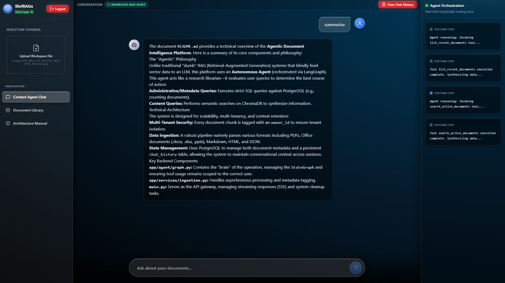
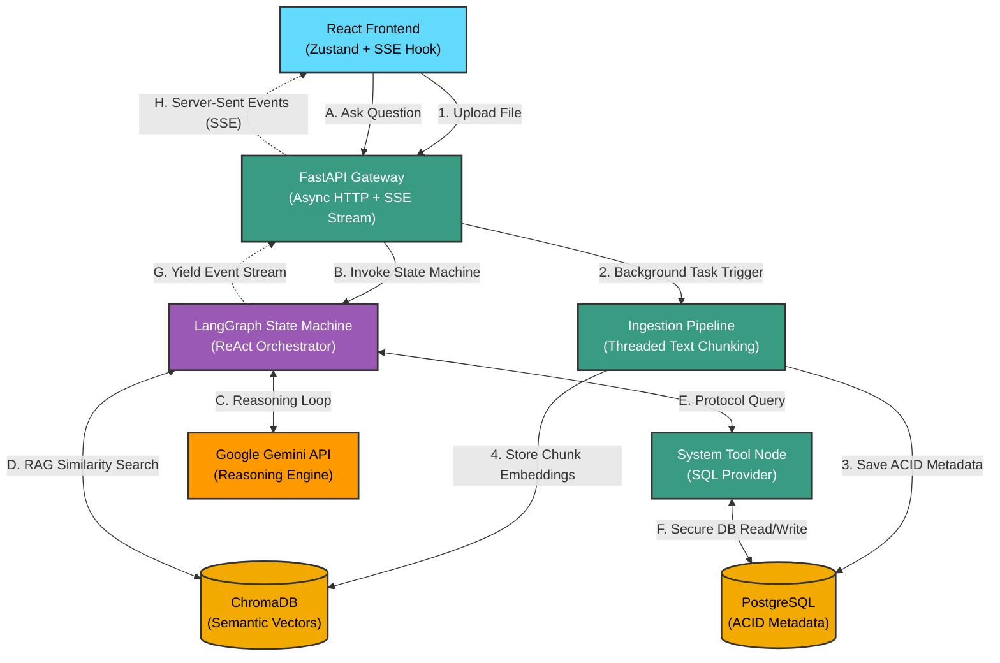

<div align="center">
  <!-- Status & License Badges -->
  
  
  
  <br><br>

  <!-- Technology Badges -->
  
  
  
  
  
  
  
  
  <br><br>
  
<h1>🧠 Agentic Document Intelligence Platform</h1>
  <p><strong>A production-grade, asynchronous RAG architecture powered by LangGraph, Local Edge Embeddings, and Native Tool Orchestration.</strong></p>
</div>

<br />

---




## 🌐 Live Demo & Hosting

This project is actively hosted and available for testing. 
The infrastructure is containerized and provisioned on a **DigitalOcean Droplet**.

👉 **[Access the Live Platform Here](https://shriram.is-a.dev)** *(Note: The demo instance uses lightweight edge-embeddings to minimize memory footprint on the cloud server. Uploaded files are cleared on a rolling 24-hour basis).*

---

## 📖 The "What" and "Why"

### The Problem with Standard AI Chatbots
Traditional RAG (Retrieval-Augmented Generation) applications are "dumb pipes." When you ask a question, they blindly convert your text into numbers (vectors), search a database for similar numbers, stuff all the resulting text into an LLM, and hope the model figures it out. This approach fails spectacularly on basic administrative queries (e.g., *"How many documents do I have?"* or *"Delete the old Q3 report and summarize the remaining ones"*).

### The "Agentic" Solution
This platform implements an **Autonomous Agent**. Instead of a dumb pipe, the system acts like a highly trained Research Librarian. When queried, the LangGraph orchestrator pauses to evaluate its available tools. 
1. *"Are they asking for metadata?"* -> It executes a strict SQL query against PostgreSQL. No hallucinations.
2. *"Are they asking for a summary?"* -> It queries ChromaDB for semantic chunks and synthesizes an answer.
3. *"Are they just saying hello?"* -> It answers conversationally without wasting database compute.

### 📚 Supported File Formats
The ingestion pipeline natively parses and vectorizes a wide array of document types without relying on heavy, external OCR APIs:
* **Standard Text:** `.txt`, `.md`, `.rtf`, `.csv`
* **Documents & E-Books:** `.pdf`, `.epub`, `.odt`
* **Microsoft Office:** `.docx` (Word), `.xlsx` (Excel), `.pptx` (PowerPoint)
* **Structured Data:** `.json`, `.html`, `.xml` (Safely parsed via BeautifulSoup to prevent vector pollution)


### Engineering Motivations
1. **Cost & Latency Elimination:** We generate text embeddings *locally* via the `sentence-transformers` library and HuggingFace models. We bypass embedding APIs, avoiding network bottlenecks during large file ingestion.
2. **Low-Latency UX:** Large AI reasoning loops take time. By utilizing a custom **Server-Sent Events (SSE)** pipeline, the AI's internal "thoughts" (tool selections) and generation tokens are streamed directly to the React UI in real-time. No loading spinners; rapid feedback.

---

## 🏗️ System Architecture

The application enforces a strict separation of concerns between the **Write Path** (heavy, asynchronous background file ingestion) and the **Read Path** (autonomous LLM reasoning, retrieval, and execution).



---

## ✨ Core Engineering Features

### 1. True Agentic Orchestration (ReAct)
Unlike traditional endpoints that force queries linearly into a Vector DB, the LangGraph orchestrator dynamically invokes tools. Using native `langchain-google-genai` integration, the Agent securely passes `thought_signatures` and natively decides whether to run a semantic search, run an SQL query, or respond conversationally.

### 2. Dual-Layer Storage (ChromaDB + PostgreSQL)
Documents are not just vectorized; their lifecycle is actively managed.
* **ChromaDB:** Stores the dense vector representations of `RecursiveCharacterTextSplitter` chunks for cosine-similarity semantic searches.
* **PostgreSQL:** Tracks file state, upload timestamps, and a boolean `is_active` toggle. This allows users to "soft delete" documents from the AI's context window dynamically via the UI without destroying the underlying embeddings.

### 3. Decoupled Tool Endpoints & Reliability
A common failure pattern in AI engineering is coupling REST APIs to generic wrapper libraries, causing parameter ingestion crashes (like missing model-specific tokens). Our system isolates external APIs, utilizing native SDKs specifically tailored to Gemini 3.x payload requirements, preventing 400 Bad Request errors during tool loops.

---

## 🔍 Core File Functionality Reference

The repository is built for horizontal scalability. Here is a technical breakdown of the critical paths.

### 🐍 Backend Data & Orchestration (Python / FastAPI)

* **`main.py` (API Gateway & Streaming Control):** The ASGI entrypoint. It exposes standard RESTful endpoints for CRUD operations. Its most complex function is `stream_agent_response`, an async generator that subscribes to LangGraph's `astream_events`. It captures `on_chat_model_stream` (for text tokens) and `on_tool_start`/`on_tool_end` (for agent reasoning), formatting them into strict JSON `data: ... \n\n` SSE blocks for the frontend.
* **`app/agent/graph.py` (Agent Logic):** The "brain". It compiles the LangGraph `StateGraph`, attaching system prompts and custom tools to `ChatGoogleGenerativeAI`. It handles the ReAct (Reason + Act) routing, allowing the LLM to recursively call tools like `search_active_documents` until it satisfies the user's prompt.
* **`app/services/ingestion.py` (Asynchronous Data Pipeline):** Manages the `DocumentProcessor`. File ingestion is a CPU-heavy process. This module features a dynamic text-extraction router that parses 13 different file formats natively (utilizing `docx`, `openpyxl`, `beautifulsoup4`, `ebooklib`, etc.). It uses `asyncio.to_thread()` to isolate these extractions, `RecursiveCharacterTextSplitter` chunking, and local HuggingFace embedding generation. This ensures the FastAPI event loop is never blocked, allowing the server to handle concurrent user chats while processing massive documents in the background.
* **`app/tools/metadata_tools.py` (Tool Registry):** Bridges the LLM's natural language output to deterministic code execution. By wrapping SQL queries (like counting active documents) in LangChain `@tool` decorators, we force the AI to fetch exact data from PostgreSQL rather than attempting to guess or hallucinate answers based on vector proximity.
* **`tests/test_integration.py`:** The CI/CD safeguard. Simulates end-to-end user flows by uploading files, polling the metadata database to verify asynchronous ingestion completion, and validating the structural integrity of the chunked JSON Server-Sent Events stream.

### ⚛️ Frontend UI & State (React / TypeScript / Vite)

* **`src/store/chatStore.ts` (Global State Manager):** A Zustand store acting as the single source of truth. It tracks the active UI view, the chat message array, and a `thoughts` array. It contains the critical `updateLastMessageToken` function, which immutably appends streaming string tokens to the final message object, creating the typewriter effect without complex React state-lag.
* **`src/hooks/useChatStream.ts` (SSE Consumer):** A highly specialized networking hook. It bypasses standard `fetch` limitations by reading the raw `ReadableStream` from the backend. It uses a `TextDecoder` to parse incoming SSE payloads, determining if the incoming chunk is an agent thought (`eventData.thought`), a text token (`eventData.token`), or a system error, and dispatches the data to the Zustand store.
* **`src/components/ChatWindow.tsx`:** The primary interactive surface. It maps over the Zustand store, utilizing `react-markdown` with `remark-gfm` to safely render complex AI markdown outputs, tables, and code blocks.
* **`src/components/DocumentLibrary.tsx`:** The metadata control panel. It fetches the joined state of PostgreSQL and ChromaDB, providing administrators a UI to "soft-delete" (toggle) document availability in the agent's context window instantly.

---

## 📂 Repository Structure

```text
backend/
├── app/
│   ├── agent/
│   │   └── graph.py             # LangGraph ReAct node & routing logic
│   ├── services/
│   │   ├── ingestion.py         # Thread-isolated async text extraction
│   │   └── vector_store.py      # ChromaDB interface
│   ├── tools/
│   │   └── metadata_tools.py    # SQL/LangChain Tool wrappers
│   └── database.py              # Connection pooling & schemas
├── tests/
│   ├── run_tests.py             # Global test orchestrator
│   ├── test_ingestion.py        # Chunking & async error unit tests
│   └── test_integration.py      # SSE and End-to-End API tests
├── docs/
├── docker-compose.yml           # Multi-container orchestration (DB + API)
├── dockerfile                   # Backend image blueprint
├── main.py                      # FastAPI ASGI entrypoint
└── requirements.txt             

frontend/
├── src/
│   ├── components/
│   │   ├── ui/                  # shadcn accessible primitives
│   │   ├── ChatWindow.tsx       # Live SSE markdown renderer
│   │   ├── DocumentLibrary.tsx  # CRUD UI for metadata & vector tables
│   │   ├── DocumentSidebar.tsx  # Multipart upload dropzone
│   │   └── ThoughtStream.tsx    # Real-time LangGraph node execution feed
│   ├── hooks/
│   │   └── useChatStream.ts     # Custom chunk-buffering SSE Parser
│   ├── lib/
│   │   ├── api.ts               # Centralized HTTP client layer
│   │   └── utils.ts             
│   ├── store/
│   │   └── chatStore.ts         # Zustand global state
│   ├── App.tsx                  # Root layout & view controller
│   └── main.tsx                 
├── package.json                 
├── tailwind.config.js           
└── vite.config.ts               
```

---

## 🚀 Getting Started

### 1. Prerequisites
* **Docker & Docker Compose** (Recommended for easiest database setup)
* **Node.js 18+** & npm
* **Python 3.11+** (If running backend natively)
* A Google Gemini API Key

### 2. Environment Configuration
Create a `.env` file in the `/backend` directory:

```env
# AI Engine
LLM_API_KEY=your_gemini_api_key_here
LLM_MODEL=gemini-3.1-flash-lite

# Database config
USE_POSTGRES=true
DB_HOST=postgres
DB_PORT=5432
DB_NAME=rag_metadata
DB_USER=postgres
DB_PASSWORD=super_secure_password

# Gateway Settings
API_PORT=8000
```

### 3. Local Development Setup
**Start the Backend (Docker):**
```bash
cd backend
docker compose up --build -d
```
*This spins up the PostgreSQL container and the FastAPI server. The database schema will initialize automatically.*

**Start the Frontend:**
```bash
cd frontend
npm install
npm run dev
```
*The Vite server will start on `http://localhost:5173` and automatically proxy API calls to port `8000`.*

---

## 🧪 Testing Suite & Reliability

To ensure robust CI/CD, the backend implements a specialized `pytest` suite.

* **Unit Tests (`test_ingestion.py`):** Ensures text splitters do not breach token boundaries and verifies async exception handling if ChromaDB threading fails.
* **Integration Tests (`test_integration.py`):** An end-to-end loop that uploads a physical markdown file, polls the metadata tool to verify ingestion, and validates the HTTP fragmented JSON stream (SSE) outputs.

**Run locally:**
```bash
cd backend
python tests/run_tests.py
```

---

## 💡 Future Scalability (Roadmap)
* **Redis Caching:** Implement caching on `/api/v1/tools/document_count` to prevent database thrashing under high UI concurrency.
* **Pessimistic Locking:** Add transaction locks in PostgreSQL for the `is_active` toggle to prevent race conditions when multiple admins modify context simultaneously.
* **OAuth2 Authentication:** Integrate standard JWT/OAuth flows to create multi-tenant workspaces with granular permissions on document visibility.
* **OpenTelemetry:** Add distributed tracing across the FastAPI gateway, LangGraph orchestrator, and Gemini API to identify bottlenecks in the reasoning loop visually.

## Copyright
**Copyright (c) 2026 Shriram Govindarajan. All Rights Reserved.**
This repository is available for review purposes only in connection with job applications. No license is granted to use, copy, distribute, or modify this code.