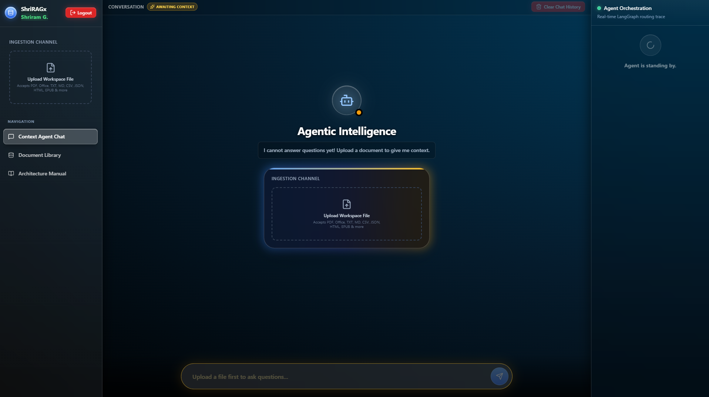
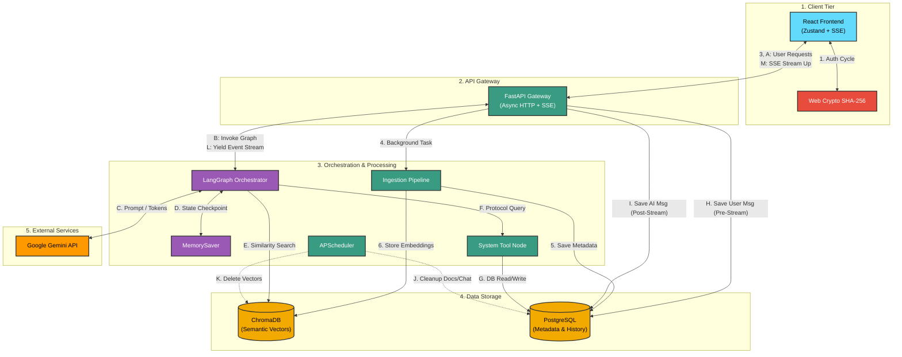

<div align="center">
  <!-- Status & License Badges -->
  
  
  
  <br><br>

  <!-- Technology Badges -->
  
  
  
  
  
  
  
  
  
  
  <br><br>
  
<h1>ShriRAGx: An Agentic Document Intelligence Platform</h1>
  <p><strong>A secure, multi‑tenant, production‑grade RAG architecture with autonomous agentic orchestration.</strong></p>
</div>

<br />

---




## 🌐 Live Demo & Hosting

This project is actively hosted and available for testing. 
The infrastructure is containerized and provisioned on a **Microsoft Azure B-Series Virtual Machine**.

👉 **[Access the Live Platform Here](https://shriram-agentic-rag.austriaeast.cloudapp.azure.com/)** *(Note: The demo instance uses lightweight edge-embeddings and virtual swap memory allocations to minimize the physical RAM footprint on the cloud server. Uploaded files are cleared on a rolling 24‑hour basis).*

---

## 📖 The "What" and "Why"

### The Problem with Standard AI Chatbots
Traditional RAG (Retrieval-Augmented Generation) applications are "dumb pipes." When you ask a question, they blindly convert your text into numbers (vectors), search a database for similar numbers, stuff all the resulting text into an LLM, and hope the model figures it out. This approach fails spectacularly on basic administrative queries (e.g., *"How many documents do I have?"* or *"Delete the old Q3 report and summarize the remaining ones"*).

### The "Agentic" Solution
This platform implements an **Autonomous Agent**. Instead of a dumb pipe, the system acts like a highly trained Research Librarian. When queried, the LangGraph orchestrator pauses to evaluate its available tools. 
1. *"Are they asking for metadata?"* -> It executes a strict SQL query against PostgreSQL. No hallucinations.
2. *"Are they asking for a summary?"* -> It queries ChromaDB for semantic chunks and synthesizes an answer.
3. *"Are they just saying hello?"* -> It answers conversationally without wasting database compute.

### 📚 Supported File Formats
The ingestion pipeline natively parses and vectorizes a wide array of document types without relying on heavy, external OCR APIs:
* **Standard Text:** `.txt`, `.md`, `.rtf`, `.csv`
* **Documents & E-Books:** `.pdf`, `.epub`, `.odt`
* **Microsoft Office:** `.docx` (Word), `.xlsx` (Excel), `.pptx` (PowerPoint)
* **Structured Data:** `.json`, `.html`, `.xml` (Safely parsed via BeautifulSoup to prevent vector pollution)

### Multi‑Tenant Security by Design
The system was rebuilt to serve **multiple isolated users** without the overhead of a full OAuth provider. Instead, the React frontend uses the **Web Crypto API** to compute a SHA‑256 hash of the username + password. This hex string becomes the `session_id` (and `owner_id`). The backend never sees the raw credentials. All data (PostgreSQL rows and ChromaDB vectors) are tagged with this `owner_id`, and every query, tool call, and vector retrieval applies a strict filter. The result: **zero‑effort tenant isolation** with no external identity provider.

### Engineering Motivations
1. **Cost & Latency Elimination:** We generate text embeddings *locally* via the `sentence-transformers` library and HuggingFace models. We bypass embedding APIs, avoiding network bottlenecks during large file ingestion.
2. **Low-Latency UX:** Large AI reasoning loops take time. By utilizing a custom **Server-Sent Events (SSE)** pipeline, the AI's internal "thoughts" (tool selections) and generation tokens are streamed directly to the React UI in real-time. No loading spinners; rapid feedback.
3. **Resource‑Aware Deployment:** The platform runs on memory‑constrained Azure VMs. To prevent OOM crashes, a **hourly garbage collector** purges all documents older than 24 hours—both from PostgreSQL and ChromaDB—reclaiming disk and memory.

---

## 🏗️ System Architecture

The application enforces a strict separation of concerns between the **Write Path** (heavy, asynchronous background file ingestion) and the **Read Path** (autonomous LLM reasoning, retrieval, and execution). The new multi‑tenant and memory layers are highlighted.



---

## ✨ Core Engineering Features

### 1. True Agentic Orchestration (ReAct)
Unlike traditional endpoints that force queries linearly into a Vector DB, the LangGraph orchestrator dynamically invokes tools. Using native `langchain-google-genai` integration, the Agent securely passes `thought_signatures` and natively decides whether to run a semantic search, run an SQL query, or respond conversationally.

### 2. Dual‑Layer Storage with Tenant Isolation
* **ChromaDB:** Stores dense vector representations of `RecursiveCharacterTextSplitter` chunks, each tagged with the `owner_id`. All retrievals use a compound `$and` filter to enforce tenant boundaries.
* **PostgreSQL:** Tracks file state, upload timestamps, `is_active` toggle, and – critically – the `owner_id` column. Every SQL query includes `WHERE owner_id = %s` to guarantee isolation.

### 3. Agentic Memory (LangGraph Checkpointing)
The platform now uses `MemorySaver` as the checkpointer during graph compilation. By passing the user's `session_id` as the `thread_id` in `RunnableConfig`, the agent retains conversational context across multiple turns. Users can refer back to earlier statements (e.g., *"My secret code is 4455"*) without re‑uploading documents.

### 4. Automated Garbage Collection (Resource Protection)
Running local HuggingFace embeddings and ChromaDB on a 1 GiB RAM Azure VM is challenging. Without cleanup, old vectors and metadata accumulate, leading to OOM kills. A **background APScheduler** runs every hour and:

- Queries PostgreSQL for documents older than 24 hours.
- For each expired document, deletes its vectors from ChromaDB using the compound `{source, owner_id}` filter.
- Deletes the corresponding PostgreSQL rows.
- Logs the operation.

This guarantees the system remains responsive even with continuous uploads.

### 5. Client‑Side Hashing (Zero‑Trust Authentication)
The frontend never sends plaintext passwords. Instead, it concatenates the username and password, applies the SHA‑256 algorithm via `crypto.subtle.digest()`, and stores the resulting 64‑character hex string as the `sessionId` in the Zustand store. This hash is used as the `owner_id` in all API calls. The backend remains completely stateless with respect to user credentials – it only sees the hash.

### 6. Persistent Chat History (Session‑Aware)
Chat history is no longer ephemeral. All user and assistant messages are automatically saved to a dedicated `chat_history` table in PostgreSQL (or SQLite) and indexed by `session_id`. On login, the frontend loads the complete conversation history, allowing users to continue discussions seamlessly across page refreshes and browser restarts. The same 24‑hour garbage collection policy that purges expired documents also deletes old chat logs, ensuring the database remains lightweight and privacy‑compliant.

### 7. Automated CI/CD Pipeline
Deployments are fully automated via GitHub Actions. Pushes to the `main` branch trigger a secure SSH workflow that synchronizes the repository on the Azure VM, safely halts containers to prevent OOM errors, rebuilds the Docker environment, and aggressively prunes dangling images to conserve storage on the constrained VM disk.

---

## 🔍 Core File Functionality Reference

The repository is built for horizontal scalability. Here is a technical breakdown of the critical paths.

### 🐍 Backend Data & Orchestration (Python / FastAPI)

* **`main.py` (API Gateway & Streaming Control):** The ASGI entrypoint. It exposes RESTful endpoints that now require `session_id` as a query param or form field. The `lifespan` context manager starts the APScheduler for hourly cleanup. The SSE generator streams tokens and agent thoughts to the frontend.
* **`app/agent/graph.py` (Agent Logic):** The "brain". It compiles the LangGraph `StateGraph` with `MemorySaver` checkpointing. All tools (including `search_active_documents`) now accept a `RunnableConfig` parameter to extract the `thread_id` and enforce tenant isolation.
* **`app/services/ingestion.py` (Asynchronous Data Pipeline):** Manages the `DocumentProcessor`. It now accepts an `owner_id` parameter, which is added to every chunk's metadata before storage in ChromaDB.
* **`app/tools/metadata_tools.py` (Tool Registry):** All tools (e.g., `get_document_count`) now read the `thread_id` from the `config` object and append `AND owner_id = %s` to every SQL query.
* **`app/services/chat_history.py`:** (New) Provides helper functions to insert user/assistant messages into the `chat_history` table and retrieve them by `session_id`. Used by both the streaming and non‑streaming chat endpoints.
* **`app/database.py`:** The schema now includes a `documents` table (with `owner_id` for tenant isolation) **and** a new `chat_history` table (`id`, `session_id`, `role`, `content`, `created_at`) to persist conversational context across sessions.
* **`tests/`:** The test suite has been expanded to cover multi‑tenant isolation, agent memory, and garbage collection logic.

### ⚛️ Frontend UI & State (React / TypeScript / Vite)

* **`src/store/chatStore.ts`:** Now stores the `sessionId` (null until login). All components pull this value to pass to API calls.
* **`src/lib/api.ts`:** Every function (`uploadFile`, `chatStream`, `getDocuments`, `toggleDocument`, `deleteDocument`, `getDocumentChunks`) now requires a `sessionId` parameter and includes it as a query param, form field, or JSON body.
* **`src/components/Login.tsx`:** The entry point. Uses the Web Crypto API to hash credentials and sets the `sessionId` in the store. Includes a 24‑hour data wipe warning. Chat history, session data, and uploaded files are synchronized across different devices and clients.
* **`src/App.tsx`:** Conditionally renders the `Login` component if `sessionId` is null, otherwise shows the main application.

---

## 📂 Repository Structure

```text
backend/
├── app/
│   ├── agent/
│   │   └── graph.py             # LangGraph ReAct node + MemorySaver
│   ├── services/
│   │   ├── ingestion.py         # Thread‑isolated async extraction (owner_id)
│   │   └── vector_store.py      # ChromaDB interface
│   │   └── chat_history.py      # Save & retrieve persistent messages
│   ├── tools/
│   │   └── metadata_tools.py    # SQL/LangChain Tool wrappers (tenant‑aware)
│   └── database.py              # Connection pooling & schema (owner_id)
├── tests/
│   ├── run_tests.py             # Test runner script
│   ├── test_ingestion.py        # Chunking + owner_id + GC tests
│   └── test_integration.py      # Multi‑tenant & memory end‑to‑end tests
├── dist/                        # Compiled production package
├── docker-compose.yml           # Multi‑container orchestration
├── dockerfile                   # Backend image blueprint
├── Caddyfile                    # Let's Encrypt SSL Reverse Proxy
├── main.py                      # FastAPI ASGI entrypoint (with lifespan)
└── requirements.txt             # includes apscheduler

frontend/
├── src/
│   ├── __tests__/               # Frontend test suite
│   │   ├── setup.ts             # Test environment setup (crypto mocks, etc.)
│   │   ├── api.test.ts          # API client tests (session_id handling)
│   │   ├── App.test.tsx         # App routing tests (Login vs Main)
│   │   └── Login.test.tsx       # Login component tests (validation, hashing notice)
│   ├── components/
│   │   ├── ui/                  # shadcn primitives
│   │   ├── ChatWindow.tsx       # SSE markdown renderer
│   │   ├── DocumentLibrary.tsx  # CRUD UI (uses sessionId)
│   │   ├── DocumentSidebar.tsx  # Upload (uses sessionId)
│   │   ├── ThoughtStream.tsx    # Real‑time agent feed
│   │   └── Login.tsx            # Web Crypto hashing
│   ├── hooks/
│   │   └── useChatStream.ts     # SSE parser (uses sessionId)
│   ├── lib/
│   │   ├── api.ts               # HTTP client (sessionId required)
│   │   └── utils.ts             
│   ├── store/
│   │   └── chatStore.ts         # Zustand (sessionId + messages)
│   ├── App.tsx                  # Conditional rendering (Login / Main)
│   └── main.tsx                 
├── package.json                 
├── tailwind.config.js           
├── vite.config.ts               
└── vitest.config.ts             # Vitest configuration
```

---

## 🚀 Getting Started

### 1. Prerequisites
* **Docker & Docker Compose** (Recommended for easiest database setup)
* **Node.js 18+** & npm
* **Python 3.11+** (If running backend natively)
* A Google Gemini API Key

### 2. Environment Configuration
Create a `.env` file in the `/backend` directory:

```env
# AI Engine
LLM_API_KEY=your_gemini_api_key_here
LLM_MODEL=gemini-3.1-flash-lite

# Database config
USE_POSTGRES=true
DB_HOST=postgres
DB_PORT=5432
DB_NAME=rag_metadata
DB_USER=postgres
DB_PASSWORD=super_secure_password

# Gateway Settings
API_PORT=8000
```

### 3. Local Development Setup
**Start the Backend (Docker):**
```bash
cd backend
docker compose up --build -d
```
*This spins up the PostgreSQL container and the FastAPI server. The database schema will initialize automatically with the `owner_id` column.*

**Start the Frontend:**
```bash
cd frontend
npm install
npm run dev
```
*The Vite server will start on `http://localhost:5173` and automatically proxy API calls to port `8000`.*

---

## ☁️ Microsoft Azure Production Deployment

This architecture is optimized to run on a lightweight Azure B‑Series Virtual Machine (e.g., `Standard_B2ats_v2` with 1 GiB RAM) using virtual swap memory to support the local HuggingFace embedding models and ChromaDB without triggering OOM crashes.

### 1. Provision the Infrastructure
1. Create an **Ubuntu 22.04 LTS** instance in the Azure Portal.
2. Under **Inbound port rules**, ensure both **SSH (22)** and **HTTP (80)** are allowed.
3. Securely download your `.pem` SSH key and connect:
   ```bash
   ssh -i <your-key.pem> azureuser@<YOUR_AZURE_IP>
   ```

### 2. Provision Virtual Swap Memory (Critical)
Because the instance relies on 1 GiB of physical RAM, you must allocate a 2GB virtual swap file on the SSD before deploying the Docker containers.
```bash
sudo fallocate -l 2G /swapfile
sudo chmod 600 /swapfile
sudo mkswap /swapfile
sudo swapon /swapfile
# Make the swap file permanent across server reboots
echo '/swapfile none swap sw 0 0' | sudo tee -a /etc/fstab
```

### 3. Install Deployment Engines
```bash
sudo apt update
sudo apt install docker.io docker-compose-v2 git -y
```

### 4. Clone Repository & Configure Environment
```bash
git clone https://github.com/TechnoMeter/agentic-document-intelligence-platform.git
cd agentic-document-intelligence-platform/backend

# Create your environment variables file
nano .env 
# Add your LLM_API_KEY, DB_PASSWORD, etc.
```

### 5. Configure Azure DNS Label (Free Domain)
To provision a free SSL certificate via Let's Encrypt, you cannot use a raw IP address. 
1. In the Azure Portal, navigate to your Virtual Machine.
2. Click on the **Public IP address** located in the *Essentials* section.
3. Navigate to **Configuration** (under Settings).
4. Enter your preferred domain prefix in the **DNS name label** text box.
5. Click **Save**. Your domain is now formally registered (e.g., `[https://shriram-agentic-rag.austriaeast.cloudapp.azure.com/](https://shriram-agentic-rag.austriaeast.cloudapp.azure.com/)`).

### 6. Configure Reverse Proxy & SSL (Caddy)
To secure the application with HTTPS and allow the secure internal Docker user (`appuser`) to write the ChromaDB SQLite database to the host machine:

1. **Unlock host directory permissions:**
   ```bash
   sudo chmod -R 777 .
   ```
2. **Create the Caddyfile:**
   ```bash
   nano Caddyfile
   ```
   Paste the following, ensuring you replace the domain with your actual Azure or custom URL:
   ```text
   shriram-agentic-rag.austriaeast.cloudapp.azure.com {
       reverse_proxy app:8000
   }
   ```
3. **Route HTTPS traffic:**
   Open `docker-compose.yml`. Remove the exposed ports from the `app` service and define the Caddy service at the bottom:
   ```yaml
   services:
     # ...
     caddy:
       image: caddy:2-alpine
       restart: unless-stopped
       ports:
         - "80:80"
         - "443:443"
       volumes:
         - ./Caddyfile:/etc/caddy/Caddyfile
         - caddy_data:/data
         - caddy_config:/config
       depends_on:
         - app

   volumes:
     postgres_data:
     caddy_data:
     caddy_config:
   ```

### 7. Launch the Secured Platform
```bash
sudo docker compose up --build -d
```
*The React frontend and Agentic API are now fully encrypted and accessible globally via `https://<YOUR_AZURE_DOMAIN>`.*

---

## 🧪 Testing Suite & Reliability

To ensure robust CI/CD, the project includes both backend and frontend test suites.

### Backend Tests (Python / Pytest)
* **Unit Tests (`test_ingestion.py`):** Verifies text chunking, `owner_id` metadata attachment, and garbage collector logic (mocking).
* **Integration Tests (`test_integration.py`):** End‑to‑end tests have been extended to validate that messages are correctly persisted and retrieved via the new `/api/v1/chat/history` endpoint, ensuring that chat history survives a session reload and remains isolated per tenant.

**Run backend tests locally:**
```bash
cd backend
python tests/run_tests.py
```

### Frontend Tests (React / Vitest)
The frontend includes a compact, reliable test suite covering:

- **API client:** Verifies every endpoint correctly attaches the `session_id`.
- **Login component:** Validates form rendering, validation errors, and the 24‑hour wipe warning.
- **App routing:** Ensures the login screen appears when no `sessionId` is present, and the main app loads when a session exists.

**Run frontend tests locally:**
```bash
cd frontend
npm test
```

All tests are designed to run in CI/CD pipelines (GitHub Actions, etc.) and ensure that both the backend and frontend remain stable as the codebase evolves.

---

## 💡 Future Scalability (Roadmap)
* **GHCR Container Registry:** Shift the Docker build process from the Azure VM to GitHub Actions runners. Push compiled images to GHCR and configure the VM to only pull pre-built images. This eliminates deployment downtime, prevents OOM crashes on the 1 GiB server, and isolates build failures from production.
* **Redis Caching:** Implement caching on `/api/v1/tools/document_count` to prevent database thrashing under high UI concurrency.
* **Pessimistic Locking:** Add transaction locks in PostgreSQL for the `is_active` toggle to prevent race conditions when multiple admins modify context simultaneously.
* **OAuth2 Authentication:** Integrate standard JWT/OAuth flows to create multi-tenant workspaces with granular permissions on document visibility.
* **OpenTelemetry:** Add distributed tracing across the FastAPI gateway, LangGraph orchestrator, and Gemini API to identify bottlenecks in the reasoning loop visually.

## Copyright
**Copyright (c) 2026 [Shriram Govindarajan](https://shriram.is-a.dev). All Rights Reserved.** This repository is available for review purposes only in connection with job applications. No license is granted to use, copy, distribute, or modify this code.