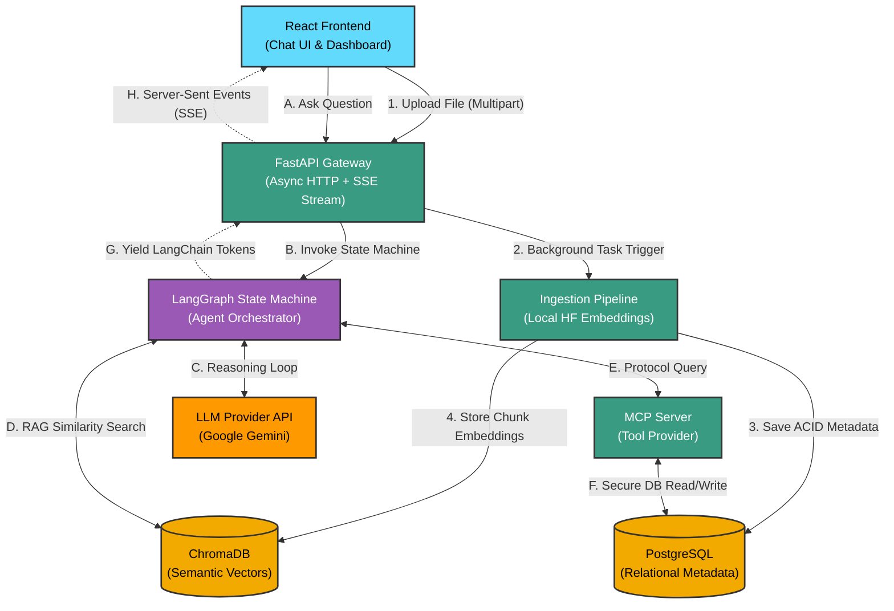

<div align="center">
  <!-- Status & License Badges -->
  
  
  
  <br><br>

  <!-- Technology Badges -->
  
  
  
  
  
  
  
  
  <br><br>
  
  <h1>🧠 Agentic Document Intelligence Platform</h1>
  <p><strong>A production-grade, asynchronous RAG architecture powered by LangGraph, Local Edge Embeddings, and the Model Context Protocol (MCP).</strong></p>
</div>

<br />

<!-- 📸 SCREENSHOT PLACEHOLDER: MAIN DASHBOARD -->
<div align="center">
  
  <br>
  <em>Figure 1: The main React workspace. Features a real-time Markdown chat interface (center) and the live Agent Orchestration telemetry feed (right).</em>
</div>

<br>

---

## 📖 The "What" and "Why" (ELI5)

### What is this?
Imagine a traditional AI chatbot as a student who has to read an entire library of books every time you ask a single question. It is slow, expensive, and prone to mixing up facts.

This project is an **Agentic RAG (Retrieval-Augmented Generation) Platform**. Instead of a student, imagine a highly trained **Librarian (The Agent)**. When you ask a question, the Librarian pauses and thinks:
1. *"Are they asking for a count of our books?"* -> (Checks the database index card).
2. *"Are they asking about a specific topic?"* -> (Goes straight to the exact paragraph in the vector database).
3. *"Are they just saying hello?"* -> (Answers directly without searching anything).

### Why did I build it this way?
Standard RAG applications simply stuff text into an LLM and hope for the best. This architecture solves three massive enterprise problems:
1. **Cost & Latency:** By generating text embeddings *locally* (using HuggingFace CPU models) instead of sending them to OpenAI/Cloud, we save money and remove network bottlenecks during file ingestion.
2. **Hallucinations:** LLMs are terrible at math and counting. By decoupling strictly structured data (PostgreSQL) from semantic data (ChromaDB), we guarantee 100% accuracy when asking metadata questions like *"How many files are uploaded?"*
3. **UX Freezing:** Large AI queries take time. We utilize **Server-Sent Events (SSE)** to stream the AI's response token-by-token back to the UI in real-time, completely eliminating loading screens.

---

## 🏗️ System Architecture

The application strictly separates the **Write Path** (heavy, asynchronous background ingestion) from the **Read Path** (autonomous LLM reasoning and execution).



<!-- 📸 SCREENSHOT PLACEHOLDER: ARCHITECTURE DIAGRAM -->
<div align="center">
  
  <br>
  <em>Figure 2: The pipeline visualization detailing the separation of concerns between the relational metadata layer and the vector storage layer.</em>
</div>

---

## ✨ Core Engineering Features

### 1. True Agentic Orchestration (ReAct)
Unlike traditional endpoints that force queries linearly into a Vector DB, the LangGraph orchestrator dynamically invokes tools. Using native `langchain-google-genai` integration, the Agent securely passes `thought_signatures` and natively decides whether to run a semantic search, run an SQL query, or respond conversationally.

### 2. Dual-Layer Storage (ChromaDB + PostgreSQL)
Documents are not just vectorized; their lifecycle is actively managed.
* **ChromaDB:** Stores the dense vector representations of `RecursiveCharacterTextSplitter` chunks for cosine-similarity semantic searches.
* **PostgreSQL:** Tracks file state, upload timestamps, and a boolean `is_active` toggle. This allows users to "soft delete" documents from the AI's context window dynamically via the UI without destroying the underlying embeddings.

### 3. Decoupled Tool Endpoints & Reliability
A common failure pattern in AI engineering is coupling REST APIs to generic wrapper libraries, causing parameter ingestion crashes (like missing model-specific tokens). Our system isolates external APIs, utilizing native SDKs specifically tailored to Gemini 3.x payload requirements, preventing 400 Bad Request errors during tool loops.

<!-- 📸 SCREENSHOT PLACEHOLDER: DOCUMENT LIBRARY -->
<div align="center">
  
  <br>
  <em>Figure 3: The Document Library. Demonstrates full CRUD capabilities, context toggling (soft-deletes), and real-time ChromeDB chunk introspection.</em>
</div>

---

## 📂 Repository Structure

The monorepo is strictly divided into frontend and backend workspaces to support independent horizontal scaling and deployment.

### Backend Pipeline (Python / FastAPI)
```text
backend/
├── app/
│   ├── agent/
│   │   ├── __init__.py
│   │   └── graph.py             # LangGraph ReAct node & routing logic
│   ├── services/
│   │   ├── __init__.py
│   │   ├── ingestion.py         # Thread-isolated async text extraction & chunking
│   │   └── vector_store.py      # ChromaDB interface
│   ├── tools/
│   │   ├── __init__.py
│   │   └── metadata_tools.py    # SQL/LangChain Tool wrappers
│   ├── __init__.py
│   └── database.py              # Connection pooling & schemas (SQLite/Postgres)
├── tests/
│   ├── __init__.py
│   ├── run_tests.py             # Global test orchestrator & port validation
│   ├── test_ingestion.py        # Chunking & async error unit tests
│   └── test_integration.py      # SSE and End-to-End API tests
├── docs/
│   ├── architecture.md          # Internal system design docs
│   └── image.png                # Architecture visual asset
├── .env                         # Environment variables mapping
├── docker-compose.yml           # Multi-container orchestration (DB + API)
├── dockerfile                   # Backend image blueprint
├── main.py                      # FastAPI ASGI entrypoint
└── requirements.txt             # Pip dependencies
```

### Frontend Workspace (React / Vite)
```text
frontend/
├── src/
│   ├── assets/                  # Static assets
│   ├── components/
│   │   ├── ui/                  # shadcn accessible primitives
│   │   │   ├── button.tsx       
│   │   │   ├── input.tsx        
│   │   │   └── scroll-area.tsx  
│   │   ├── ChatWindow.tsx       # Live SSE markdown renderer
│   │   ├── DocumentLibrary.tsx  # CRUD UI for metadata & vector tables
│   │   ├── DocumentSidebar.tsx  # Multipart upload dropzone
│   │   └── ThoughtStream.tsx    # Real-time LangGraph node execution feed
│   ├── hooks/
│   │   └── useChatStream.ts     # Custom chunk-buffering SSE Parser
│   ├── lib/
│   │   ├── api.ts               # Centralized HTTP client layer
│   │   └── utils.ts             # Tailwind class merging (clsx)
│   ├── store/
│   │   └── chatStore.ts         # Zustand global state (Message & Prompt buffering)
│   ├── App.tsx                  # Root layout & view controller
│   ├── index.css                # Global Tailwind directives
│   └── main.tsx                 # React DOM attachment
├── public/                      # Public facing static assets
├── .gitignore                   # Git exclusions
├── components.json              # shadcn CLI config
├── eslint.config.js             # Linter rules
├── index.html                   # HTML entrypoint
├── package-lock.json            # Dependency tree lock
├── package.json                 # Node dependencies
├── postcss.config.js            # PostCSS config for Tailwind
├── tailwind.config.js           # Theme configuration
├── tsconfig.app.json            # TypeScript app config
├── tsconfig.json                # TypeScript base config
├── tsconfig.node.json           # TypeScript node config
└── vite.config.ts               # Vite bundler configuration
```

---

## 🚀 Getting Started

### 1. Environment Configuration
Create a `.env` file in the `/backend` directory. Map your Gemini API key and Postgres credentials.

```env
# AI Engine
LLM_API_KEY=AIzaSy...
LLM_MODEL=gemini-flash-lite-latest

# Disable telemetry for privacy
ANONYMIZED_TELEMETRY=False

# Database config
USE_POSTGRES=true
DB_HOST=postgres
DB_PORT=5432
DB_NAME=rag_metadata
DB_USER=postgres
DB_PASSWORD=super_secure_password

# Gateway Settings
API_PORT=8000
```

### 2. Deployment (Docker / Production)
The fastest way to spin up the entire architecture (PostgreSQL, Vector Volumes, and FastAPI Gateway) is via Docker Compose. Ensure port `8000` and `5432` are available.

```bash
cd backend
docker compose up --build -d
```
*Note: Run `docker compose down -v` if you need to wipe the persistent database volumes to regenerate the schema.*

### 3. Local Development (Frontend)
Run the React Vite server locally. It is pre-configured to proxy requests to `http://localhost:8000`.

```bash
cd frontend
npm install
npm run dev
```

---

## 🧪 Testing Suite & Reliability

The backend implements a comprehensive `pytest` suite simulating production edge cases.

* **Unit Tests (`test_ingestion.py`):** Validates the `RecursiveCharacterTextSplitter` boundaries ensuring no chunk exceeds the maximum token limit. Mocks the ChromaDB `add_texts` method to simulate thread-isolated write failures.
* **Integration Tests (`test_integration.py`):** An end-to-end suite that uploads a physical markdown file, polls the metadata tool to verify async ingestion completion, and tests both standard HTTP parsing and fragmented JSON stream (SSE) outputs from the LLM.

**Run the tests locally:**
```bash
cd backend
python tests/run_tests.py
```
*(The script includes an automatic pre-flight check to ensure Uvicorn is active on port 8000 before initiating the test runner).*

<!-- 📸 SCREENSHOT PLACEHOLDER: TESTING SUITE -->
<div align="center">
  
  <br>
  <em>Figure 4: The automated test suite verifying ingestion chunking, LLM streaming, and SQL database tool invocation.</em>
</div>

---

## 💡 Future Scalability (Roadmap)
To transition this from a Portfolio Project to a fully Enterprise-ready cluster:
* Implement **Redis Caching** on the `/api/v1/tools/document_count` endpoint to prevent database thrashing under high concurrency.
* Implement **Distributed Locks (Pessimistic Locking)** in PostgreSQL when a user toggles the `is_active` state of a document, ensuring safety if multiple admins attempt to modify context simultaneously.
* Integrate **OpenTelemetry** for distributed tracing across the FastAPI gateway, LangGraph orchestrator, and external API calls to identify bottlenecks in the reasoning loop.
* Add **Role-Based Access Control (RBAC)** to the API, allowing for multi-tenant deployments with granular permissions on document visibility and agent tool usage.
* Expand the **Toolset** to include external APIs (e.g., Google Search, Wolfram Alpha) and internal microservices (e.g., User Profile Service) to demonstrate cross-service orchestration capabilities.